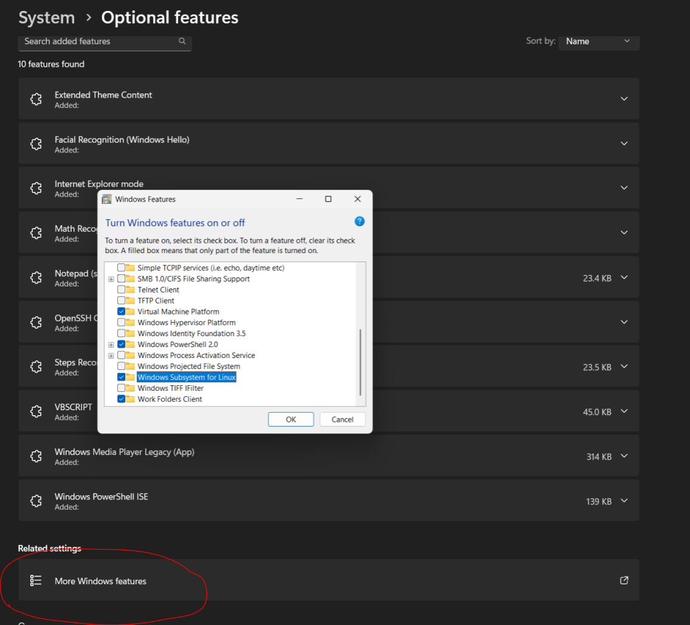
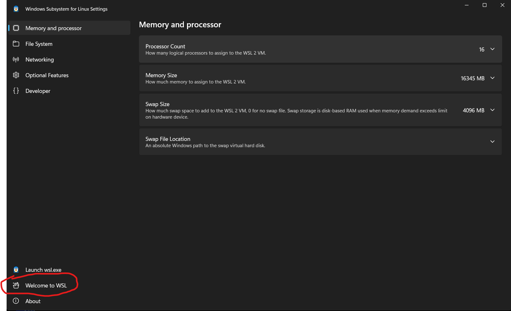
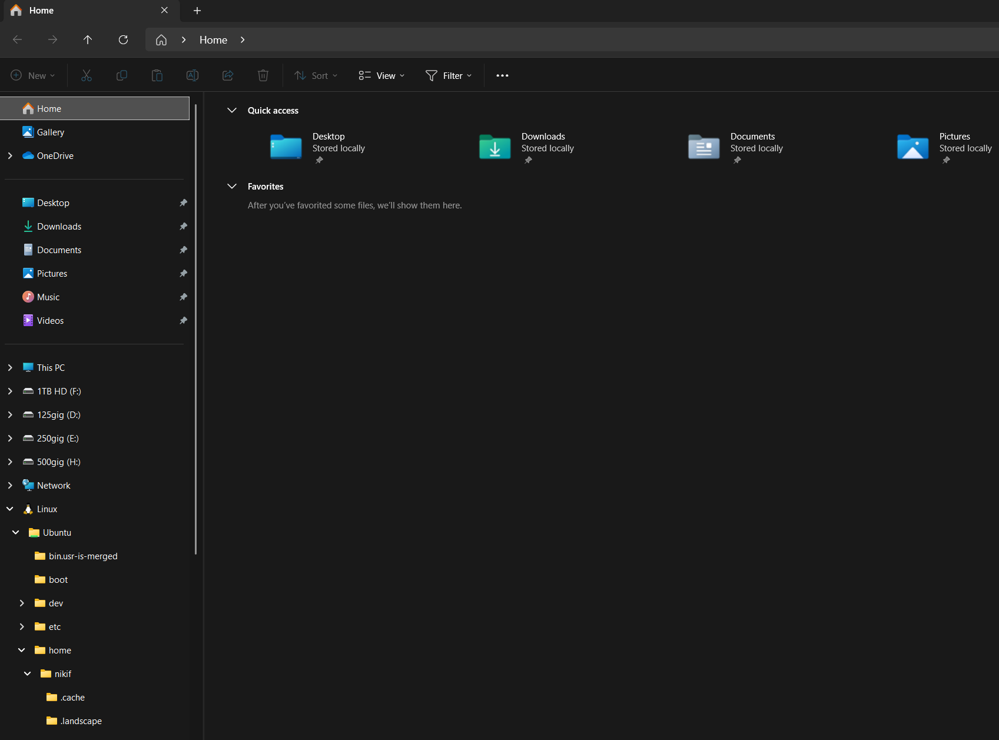
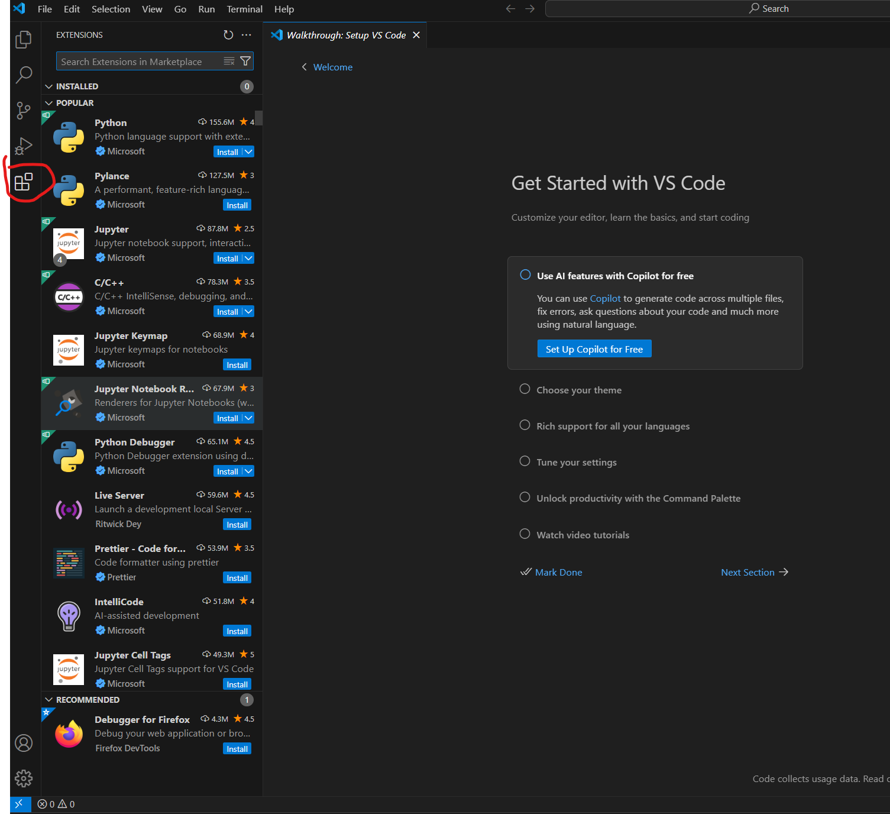
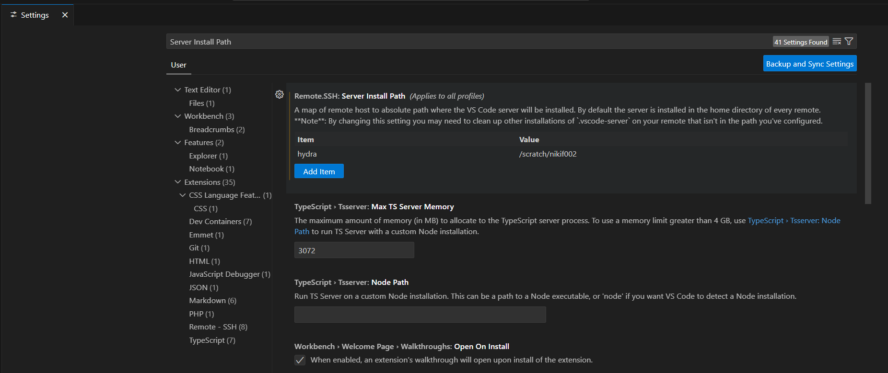
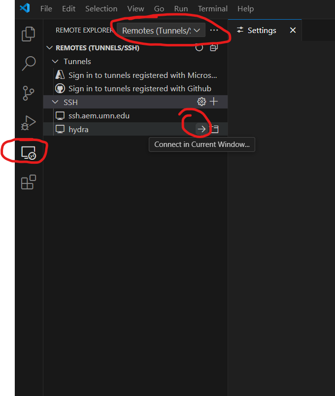
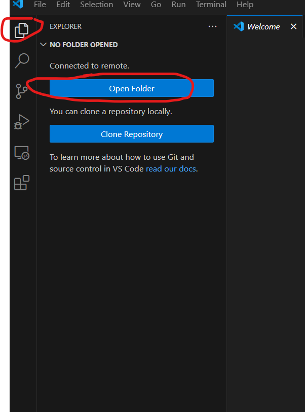

# Windows, WSL, Hydra SSH, VS Code Remote Development, and Python Debugging Setup

This guide covers:

1. Installing Windows Subsystem for Linux (WSL) with Ubuntu on Windows 11
2. Configuring SSH access to the UMN AEM gateway and Hydra
3. Connecting to Hydra through VS Code Remote Development
4. Setting up a Python environment and `debugpy` debugging on Hydra

Some steps may be optional or may need to be completed in a different order depending on your system. On older Windows versions, the WSL installation procedure may differ.

For official WSL installation instructions, see: <https://learn.microsoft.com/en-us/windows/wsl/install>

---

## 1. Install WSL and Ubuntu

### 1.1 Enable WSL in Windows Features

Go to:

```text
System Settings > Optional features > More Windows features
```

Enable **Windows Subsystem for Linux**.



### 1.2 Initialize WSL

Open a terminal, such as **Command Prompt** or **PowerShell**, and run:

```powershell
wsl
```

Follow the instructions, then restart your system.

### 1.3 Install Ubuntu

After restarting, reopen the terminal and install the Ubuntu Linux distribution:

```powershell
wsl --install Ubuntu
```

Other Linux distributions are also available.

### 1.4 Troubleshoot virtualization errors

If you receive the following error:

```text
WSL2 is not supported with your current machine configuration.
```

you may need to enable virtualization in your computer's BIOS or UEFI settings. The procedure depends on your computer manufacturer.

### 1.5 Start an Ubuntu shell

Start the Ubuntu distribution from a terminal:

```powershell
wsl -d Ubuntu
```

The Windows filesystem and the Linux filesystem are separate. You may initially start in the Windows filesystem mounted inside Linux. To move to your Linux home directory, run:

```bash
cd ~
```

### 1.6 Explore WSL settings

Open the **WSL Settings** app from the Windows Start menu and select **Welcome to WSL** for additional information.



### 1.7 Access Linux files from Windows Explorer

You can access your Linux filesystem through Windows Explorer (although this feature breaks sometimes)



### 1.8 WSL and development tools

WSL is commonly used alongside Docker on Windows. You can also connect to WSL as a remote development environment through the VS Code **Remote Development** extension.

---

## 2. Set Up SSH Access to Hydra

Here I'll use **hydra** as an example, it's fairly complicated to set up, other remote HPCs will be
different but probably easier for you

> Note that, on Windows, your "native" ssh setup is separate from your WSL ssh set up. Here I am running natively (i.e. in a Windows command prompt WITHOUT entering WSL), you should as well for setting up SSH for VSCode. The commands I give should work in Windows Powershell.

### 2.1 Connect to the gateway host

In a Windows terminal, run the following command, replacing `<your-username>` with your UMN username:

```powershell
ssh <your-username>@ssh.aem.umn.edu
```

When prompted:

1. Type `yes` to confirm the host connection.
2. Enter your UMN password.
3. Authenticate with Duo.

You should now be in your enet home directory. Leave this terminal open and open another terminal on your local Windows machine.

### 2.2 Generate an SSH key

On your local Windows machine, run:

```powershell
ssh-keygen
```

The default options are generally sufficient unless you need a different key type, filename, or passphrase behavior.

The command reports where your public key was saved. Display its contents, for example:

```powershell
cat C:\Users\<your-windows-username>\.ssh\id_ed25519.pub
```

Copy the single line of output.

### 2.3 Add the public key on the remote host

Return to the remote terminal connected to `ssh.aem.umn.edu`. From your remote home directory, open the authorized keys file:

```bash
nano .ssh/authorized_keys
```

Paste the public key into the file, then save and quit Nano:

```text
Ctrl+X, then Y
```

Disconnect from the remote host:

```bash
exit
```

Reconnect to verify the key works:

```powershell
ssh <your-username>@ssh.aem.umn.edu
```

You should no longer be prompted for your UMN password.

### 2.4 Configure the Hydra jump host

On your local Windows machine, open the following file in a text editor:

```text
C:\Users\<your-windows-username>\.ssh\config
```

Add the following content, replacing `<your-username>` with your username:

```sshconfig
Host ssh.aem.umn.edu
    HostName ssh.aem.umn.edu
    User <your-username>

Host hydra
    HostName hydra
    User <your-username>
    ProxyJump ssh.aem.umn.edu
```

> Windows may save this as `config.txt`. If that happens, rename it to `config`, for example:
>
> ```powershell
> mv .ssh/config.txt .ssh/config
> ```

You should now be able to connect directly to Hydra:

```powershell
ssh hydra
```

You may need to type `yes` once more to accept Hydra as an unknown host.

### 2.5 Create a scratch directory on Hydra

The home directory on Hydra is small. Create a scratch directory by running:

```bash
/stage/site/common/bin/make-scratch.sh
```

For additional information, read:

```bash
cat /scratch/README.TXT
```

---

## 3. Configure VS Code for Remote Development

### 3.1 Install VS Code

Download and install Visual Studio Code from:

<https://code.visualstudio.com/download>

Many VS Code features are provided through extensions. Extensions installed on your host machine are separate from extensions installed on a remote machine or inside a container.

### 3.2 Install the Remote Development extension

In VS Code, open the Extensions view and install **Remote Development**.



### 3.3 Set the VS Code server install path for Hydra

Hydra requires a preliminary configuration because its home directories are small.

Open VS Code settings using the gear icon in the lower-left corner or the keyboard shortcut:

```text
Ctrl+,    or    Command+,
```

Search for:

```text
server install path
```

Under **Remote - SSH**, add an entry with:

- Key: `hydra`
- Value: your Hydra scratch directory

This causes the VS Code server files to be installed in scratch space rather than filling the small home directory.



> Note: you have "User" settings and individual settings for each remote. The "User" settings take preference.


### 3.4 Use Bash as the integrated terminal on Hydra

Set the following VS Code preference to `bash` so that terminals opened on Hydra use Bash instead of the default `tcsh` shell:

```text
Terminal > Integrated > Default Profile: Linux
```

### 3.5 Connect to Hydra from VS Code

Open the **Remote Explorer** in VS Code and connect to `hydra`.



When prompted for the remote platform, select:

```text
linux
```

VS Code may take a little time to upload and configure its remote components.

### 3.6 Open a remote working folder

After connecting, open the **Explorer** view and select **Open Folder**.



On Hydra, it is recommended that you open your scratch folder and work there. You may use individual VS Code workspaces per project, or open a higher-level directory containing several projects.

Open an integrated terminal using:

```text
Ctrl+`    or    Command+`
```

At this point, the basic remote development setup is complete.

---

## 4. Debug Python on Hydra

To demonstrate some complexities of choosing Python executables, I will use `micromamba` to install `KLIFF` on `hydra`. 

### 4.1 Install micromamba

The installation instructions for micromamba are here:

<https://mamba.readthedocs.io/en/latest/installation/micromamba-installation.html>

But I couldn't figure out how to go through the enet proxy, so instead just copy and paste the install script into a file on hydra:

<http://micro.mamba.pm/install.sh>

Run the installer using either of the following commands:

```bash
chmod +x install.sh
./install.sh
```

or:

```bash
bash install.sh
```

When choosing installation paths on Hydra, place micromamba files in your scratch directory.

### 4.2 Activate micromamba

Reload your shell configuration:

```bash
source ~/.bashrc
```

### 4.3 Create a Python environment

Create an environment containing JupyterLab, `debugpy`, and KLIFF:

```bash
micromamba create -n kliff-env jupyterlab debugpy kliff
```

Activate your environment with:

```bash
micromamba activate kliff-env
```

### 4.4 Install VS Code Python extensions

Install the following VS Code extensions on the remote Hydra connection:

- **Jupyter**
- **Python**

I would also recommend turning off the VSCode setting
```text
Jupyter: Debug Just My Code
```

---

## 5. VS Code Python Debugger Configuration

Create or edit `.vscode/launch.json` in your project directory and add the following debugging configurations:

```json
// Use IntelliSense to learn about possible attributes.
// Hover to view descriptions of existing attributes.
// For more information, visit: https://go.microsoft.com/fwlink/?linkid=830387
{
    "version": "0.2.0",
    "configurations": [
        {
            "name": "Attach to process",
            "type": "debugpy",
            "request": "attach",
            "connect": {
                "port": 5678,
                "host": "localhost"
            },
            "pathMappings": [
                {
                    "localRoot": "${fileDirname}",
                    "remoteRoot": "${fileDirname}"
                }
            ],
            "justMyCode": false
        },
        {
            "name": "Python: Current File",
            "type": "debugpy",
            "request": "launch",
            "program": "${file}",
            "console": "integratedTerminal",
            "cwd": "${fileDirname}",
            "justMyCode": false
        }
    ]
}
```

### 5.1 Attach `debugpy` to a running script

Add the following snippet to a Python script where you want to wait for the VS Code debugger:

```python
import debugpy

# 5678 is the default attach port in the VS Code debug configuration above.
# Unless a host and port are specified, the host defaults to 127.0.0.1.
debugpy.listen(5678)
print("Waiting for debugger attach")
debugpy.wait_for_client()
debugpy.breakpoint()

print("Break on this line")
```

> Note that `${fileDirname}` refers to the currently open file. If the file is already open, the debugger appears to enter that editable file rather than a read-only version.

---

## 6. Debugging LAMMPS

