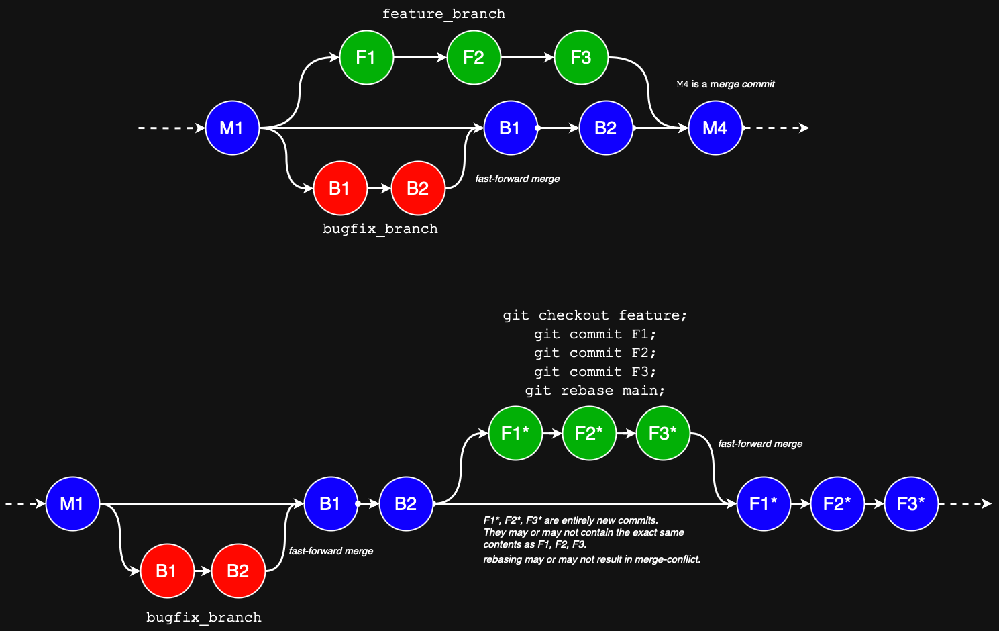

# Introduction to Git & Github

## Requirements
### Sign-up on Github
- Sign-up for a free account on [Github](https://github.com).

### Install git
- Install git on your local machine by following instructions specific to your operating-system [here](https://git-scm.com/book/en/v2/Getting-Started-Installing-Git)
- Configure some of the global settings for your local installation of git.
    ```sh
    git config --global user.name "myusername"      # username
    git config --global user.email "abc@xyz.com"    # email-id
    git config --global core.editor "nano"          # default text-editor
    git config --global init.defaultBranch "main"   # default branch name
    ```
- You could use the same username and email-id as your Github account. \
`"main"` is a fairly common default branch name across the world. We will cover *branches* in a later section. \
The text-editor will come in handy when we want to *modify commit history* of our project. We will cover this in a later section. You could use a different text-editor if you wish (such as `"vim"` or `"emacs"`).

> The `user.name` and `user.email` are not *authentication* parameters. They are merely used to identify who contributed what. We will cover authentication in a later section.

### Install VS-Code extension
- Install a VS-Code extension for Git. GitLens is a popular one. 
    

## Git & Github
Git is a distributed version control system used to track changes in source code during software development. It allows multiple developers to collaborate on a project efficiently by managing code history, *branching*, and *merging*. 

GitHub is a *web-based platform* built around Git that provides a user-friendly interface for hosting and sharing Git repositories. It offers collaboration tools such as *issue tracking*, *pull requests*, and discussion boards thus, making it a central hub for open-source projects.

### Version-Control
Version control means keeping track of creating and modifying source code. It's a bit like the "track changes" function in MS Word, but far more efficient and better at resolving conflicts when two or more people are working on the same document. Many people keep track of different versions of a document by saving multiple copies and appending notes like "version 3" to their filename. This is inefficient for several reasons:
- there is a lot of redundancy
- the amount of space taken up in your filesystem grows linearly with the number of versions
- it is not transparent - there is no guarantee of a consistent naming scheme to indicate versions
- it is fragile - if the filename is changed, or if someone opens the file and makes and saves a trivial edit, then the document modification date no longer corresponds to its relative position in the versioning history
- there is no framework for resolving conflicting changes by multiple authors
Version (or "revision") control systems (VCSs) were developed to address these problems in the context of collaborative software development. Currently, one of the most popular VCSs is git.

> Git can only track text-based files (`.txt`, `.py`, `.cpp`, `.f90`, etc). \
Git cannot meaningfully track binary format files (`.pdf`, `.jpeg`, etc.)\
If you wish to selectively ignore tracking certain files (such as reference notes and scratch-pads) create a `.gitignore` file in the root of your repository and list the filenames and foldernames to be ignored. For example 
```sh
#.gitignore
scratch.txt # a specific file
build/ # the entire build/ folder
refs/*.txt # regex to specify all .txt files within the refs/ folder
``` 

### Commits
- A commit in Git is a snapshot of your project at a specific point in time. Each commit is made up of 5 properties:
    - The changes to the code-base (also called *diff*)
    - a descriptive message about the changes
    - the author of the contribution
    - the timestamp of the contribution
    - the `commit-hash`, a 40 character hexadecimal SHA-1 checksum computed from the above 4 properties.

    

- The `commit-hash` is useful when comparing the state of the project at two different times.
### Staging
- *Staging* is a pre-cursor step to committing. A commit might involve changes across multiple files. We first gather all such changes before collectively committing them.

### Branching
- *Branches* are a powerful feature of Git. It allows you to create an independant line of development without affecting the main codebase.

    

- In the diagram above, there are 5 branches
    - The `main` branch contains the most stable version of your codebase. It is ready to be deployed and distributed to end-users. 
    - When a bug was discovered in `main`, a new branch `bugfix` was created from the latest `main` branch. Commits `B1`, `B2` were the necessary changes to fix the bug. 
    - While the bug was being addressed, your collaborator pushed a minor change directly into `main`. This is generally discouraged but it is acceptable for minor issues or emergency hotfixes.
    - While the bug was addressed, your collaborator branched out from `main` to implement a new feature. The commits `F1`,`F2`,`F3` were the necessary changes for this new feature. 
    - While your collaborator was implementing the new feature, you completed the bugfix and merged your `bugfix` branch into the `main` branch. This results in a *merge-commit* due to the *non-linear history* of `bugfix` and `main` (The commit `M2` does not exist in the `bugfix` branch). 
    - After fixing the bug you discovered an opportunity to reduce code-duplication so you immediately branch `refactor_branch` from `main`. The `refactor_branch` contains your contributions from `bugfix_branch`. 
    - While you were working on the code-refactoring, your collaborator completed the feature implementation and merged their changes into `main`. They immediately start updating the documentation for this new feature. The `documentation_branch` is merged as a *fast-forward commit* because it has a *linear history* with `main`. 
    - Finally, you finished your work on refactoring the code and merged your `refactor_branch` into `main`.

- The `bugfix_branch`, `refactor_branch`, `feature_branch`, and `documentation_branch` are commonly called *topic-branches*. If topic-branches modify common codespace, Git will alert us of a *merge-conflict* when we attempt to merge the topic-branch into `main`. We will address this in a later section. 

### Issue-Tracking
We make extensive use of GitHub's issue tracking system to manage projects in the lab.  Generally, we create a new repository for each project, and each repository has its own issue tracker.  Using the issue tracker, we do the following:

1. Plan tasks and project milestones by creating an issue for each task that needs to be accomplished, and by organizing these issues into milestones with set deadlines.
2. Create issues when a problem arises.  If you don't know how to do something, or if your code has a bug that you can't fix, then write an issue.  If it's a bug, describe the problem and identify the affected source code and the scenario that causes the bug to arise.  Other people in the group will be able to see the issue and help you fix the problem.  This is also valuable for documenting how your bug was resolved.  When the bug is fixed, close the issue either using the web interface or by committing the bug fix with the comment "fixed #27" if the issue is number #27.  Read [this GitHub manual](https://help.github.com/articles/closing-issues-via-commit-messages/) for more information.
3. If you simply have a question, post an issue.  The issue tracker can then serve as a discussion forum with other members of the lab.

    


## Demo (offline)
### Create a repo
- Create a new repo on your local machine
    ```sh
    git init demo_repo;   # initialize a new repo folder
    cd demo_repo;         # navigate to repo folder
    git status;             # check status of repo
    ```
    

### Staging, Commiting
- Create a new file in the repo
    ```sh
    touch notes.txt;        # create new file
    git status;             # check status of repo
    ```
    
- We created a new file `notes.txt` Git is not currently _tracking_ it's history. We need to tell Git to start tracking it. Commiting this change (create new file) will prompt Git to track it.

    ```sh
    git add notes.txt;  # stage the change
    git status;         # check status of repo
    ```

    

    ```sh
    git commit -m "create new file";    # commit the change
    git log;                            # check history
    ```
    
    
    The 40-character alphanumeric string <span style = "color:rgb(213, 186, 30);background-color:black">9a77d0... </span> is the `commit-id`

- Add some text to `notes.txt`.
    ```sh
    echo "Hello World" > notes.txt;         # append text
    git status;                             # check status
    ```
    
    
    and commit the change
    ```sh
    git add notes.txt;                      # stage
    git commit -m "append 'Hello World'";   # commit
    git log;                                # check history
    ```
    
    
    > Notice the <span style = "color:rgb(30, 182, 213);background-color:black;font-weight:600">HEAD -></span> <span style = "color:rgb(61, 213, 30);background-color:black;font-weight:600"> main </span>. Git stores commits as a [**linked-list**](https://en.wikipedia.org/wiki/Linked_list) and `HEAD` is the current pointer of the linked-list. Currently, our `HEAD` sits at the latest commit <span style = "color:rgb(213, 186, 30);background-color:black">a27700... </span> of the `main` branch. We will learn more about the `HEAD` in the section about rewinding/rebasing but for now just remember that Git stores commits as a linked-list. 

### Branching and Merging
- So far, we were directly pushing changes into the `main` branch. This is rarely the case when working on a shared codespace. Let's append another line but this time let's do it through a branch.
- Create a new branch
    ```sh
    git branch feature/append-new-line; # create new branch
    git branch -lva;                    # list all branches
    ```
    

    `-lva` flag lists all branches and their latest commits. We're currently on the `main` branch and `feature/append-new-line` has the same commit history as `main`.
- To begin working from this new branch, first `checkout` the branch
    ```sh
    git checkout feature/append-new-line; 
    git status;
    git log;
    ```
    

    > Notice the <span style = "color:rgb(30, 182, 213);background-color:black;font-weight:600">HEAD -></span> <span style = "color:rgb(61, 213, 30);background-color:black;font-weight:600"> feature/append-new-line, main </span>. Currently, our `HEAD` sits at the latest commit <span style = "color:rgb(213, 186, 30);background-color:black">a27700... </span> of the `feature/append-new-line` branch which is also the latest  commit on the `main` branch.

- And now repeat the same steps as we did in `main` - make edits, stage the change, and commit the change. 
    ```sh
    echo "Lorem Ipsum" >> notes.txt;
    git add notes.txt;
    git commit -m "append Lorem Ipsum";
    git log --oneline;
    ```
    

- We've successfully modified our `feature/append-new-line` branch. To incorporate this change into our `main` branch, we perform a *merge operation* from `feature/append-new-line` into `main`. 
    ```sh
    git checkout main;
    git diff feature/append-new-line; # show difference between branches
    ```
    
- Perform the `merge` operation
    ```sh
    git merge feature/append-new-line;
    git log --oneline;
    ```
    
    
    Observe that Git does a *Fast-forward* merge. This happens because no new commits were pushed/merged into `main` before we merged `feature/append-new-line`. The two branches are said to have a *linear history*.
    
    > 
    >
    > In the above diagram, `bugfix` branch has a *linear* history with `main` whereas `feature` branch has a *non-linear* history with `main`. A fast-forward merge merely involves updating the next-pointers on the linked-list. So `M1`'s next-pointer is directed at `B1`.

- We've finished merging our topic branch `feature/append-new-line` into `main` hence, we can delete the topic branch by executing `git branch -d feature/append-new-line`. 

## Merge-Conflict (offline)
- When two or more collaborators work on a shared codespace, you are likely to encounter a *merge-conflict*. Let's pick-up where we left off last time and recreate a merge-conflict between two topic branches. We'll also start using Visual Studio Code for managing our Git repository so open your `demo_repo/` folder in VS-Code.

    <table style="width:720px;border:1px solid rgb(128, 128, 128)">
    <tr>
        <th style="border:1px solid  rgb(128, 128, 128)">Open Folder in VS-Code</th>
        <th style="border:1px solid  rgb(128, 128, 128)">Source-Control in VS-Code</th>
    </tr>
    <tr>
        <td style="border:1px solid  rgb(128, 128, 128)"></td>
        <td style="border:1px solid  rgb(128, 128, 128)"></td>
      </tr>
    </table>


- Create two new topic branches `refactor/swap-lines` and `feature/append-line`. 
    ```sh
    git branch refactor/swap-lines;
    git branch feature/append-line;
    git branch -va; # confirm all 3 branches have same commit history
    ```
    

- Checkout the `refactor/swap-lines` branch (`git checkout refactor/swap-lines`) and swap the first two lines of `notes.txt`. Then stage and commit the change.

    

- Checkout the `feature/append-line` branch (`git checkout feature/append-line`) and add a line to `notes.txt`. Then stage and commit the change.

    

    > The two branches `refactor/swap-lines` and `feature/append-line` are said to *diverge*. 

- First merge `refactor/swap-lines` into `main`. 
    ```sh
    git checkout main;
    git merge refactor/swap-lines;
    git log --oneline;
    ```
    
    


- Now merge `feature/append-line` into `main`. 
    ```sh
    git checkout main;
    git merge feature/append-line;
    ```

    

    Git will alert us of a *merge-conflict* because the changes from `refactor/swap-lines` and `feature/append-line` modify the same code-space and it's not immediately apparent to Git how to combine those changes. There are a few different possible combinations. 
    
<table border="1" cellpadding="10" style="margin:auto">
<tr>
<th>feature branch</th>
<th>main, refactor</th>
</tr>
<tr>
<td><pre style="background-color: rgb(150,150,150); font-family: monospace; color:black">
Hello World
Lorem Ipsum
New Feature
</pre></td>
<td><pre style="background-color: rgb(150,150,150); font-family: monospace; color:black">
Lorem Ipsum
Hello World
</pre></td>
</tr>
</table>

<table border="1" cellpadding="10" style="margin:10px auto">
<tr>
<th>❌ feature duplicates <br> main content</th>
<th>❌ feature partially <br>overwrites refactor</th>
<th> ✅ feature appends <br> to refactor</th>
</tr>
<tr>
<td><pre style="background-color: rgb(150,150,150); font-family: monospace; color:black">
Lorem Ipsum
Hello World
Lorem Ipsum
New Feature
</pre></td>
<td><pre style="background-color: rgb(150,150,150); font-family: monospace; color:black">
Lorem Ipsum
New Feature
</pre></td>
<td><pre style="background-color: rgb(150,150,150); font-family: monospace; color:black">
Lorem Ipsum
Hello World
New Feature
</pre></td>
</tr>
</table>

- We need to manually resolve this merge-conflict using VS-Code. Open the `notes.txt` file in the Source-Control Tab and click <button style="color:white;background-color:rgb(12, 125, 224);padding:5px;border-radius:5px">Resolve in Merge Editor</button> at the bottom right.
    
    
- This opens the VS-Code Merge-Editor UI. As the name suggests, it enables you to apply changes before merging. The *Incoming* left panel shows the changes from `feature/append-line`. The *Current* right panel shows state of the `main` branch. The *Result* bottom panel previews the result of the merge operation your editing. 

    

- There are a few different options - `Accept Incoming`, `Accept Current`, `Accept Combination`.
    - ❌ `Accept Current` : This ignores all changes from the `feature/append-line` branch. Clearly this is not what we want.

        

    - ❌ `Accept Incoming` : On the `feature` branch **"Hello World"** is followed by **"Lorem Ipsum"** and **"New Feature"**. On the `main` branch, `Hello World` is the last line. So Git merely tacks on **"Lorem Ipsum"** and **"New Feature"** to the end of the `main` branch.

        
    
    - ✅ `Accept Combination` : This correctly appends **"New Feature"** to the end of the file without affecting the  prior two lines. 
        

    - ✅ `Manual Resolution` : When the merge conflict only concerns a few lines you could directly edit the content in the *Result panel* 
        

- After the merge-conflict is resolved, there is an additional *merge commit* to the `main` branch. You may edit the commit message if you choose to but the default commit message `"Merge branch <branch-name>"` is recommended. 

    

## Demo (online)
- So far our work has been on our local machine. To collaborate with other developers we must setup a remote repository on Github and *track* it from our local repository. 

### Github Authentication
- Before we setup the remote repository, any collaboration on the cloud must involve secure authentication. Github provides a few options for this.
- <b> SSH Keys </b>
    - This is the easiest and recommended method. If you haven't already, generate your private-public ssh-keys. Then copy the contents of the public key (`.pub`) into your clipboard. 
    - Navigate to your __Github Profile Settings__ and under the __Access Settings__, click on __SSH and GPG keys__. Then add a new SSH key. Give it a unique title and paste the contents of your `.pub` file into the textbox. 
    - Once you've registered your SSH key, it becomes straightforward to access your repos  
        ```sh
        # clone a remote repo into your local machine
        git clone git@github.com:[USER]/[REPO]
        
        # connect your local repo with a specific remote repo
        git remote add origin git@github.com:[USER]/[REPO]
        ```
- <b> Github Auth Tokens </b>
    - Github Auth Tokens allow for a more granular access control and are typically used to perform advanced operations using the Github API (such as automation & CI/CD) but, they can also be used for performing regular git repo operations such as contributing code. 
    - To generate your Auth Tokens navigate to your __Github Profile Settings__, and click on __Developer Settings__.  Then under __Personal Access Tokens__ click on __Fine-grained tokens__ or __Tokens (classic)__. 
    - Both types of tokens have a different UI for configuring the access control restrictions of the token. You should be familiar with  
    <!-- -  -->
    - Once you've generated your access-token you need to specify it when managing repos
        ```sh
        git clone https:// [TOKEN]@github.com/[USER]/[REP0]
        git remote add origin https://[TOKEN]@github.com/[USER]/[REP0] 
        ```

- <b> Open up specific repos for collaborations </b>
    - You can also open up a specific repo to contributions from a specific user. 
    - Navigate to your repo's __Settings__ and under __Access__ click on __Collaborations__. Now specify the users you wish to authorize to contribute directly into your repo. 
    
### Creating a repo on Github
- To Create a new repo click on the <button style="background-color:green;color:white;padding:5px; border-radius:5px;border:0">New</button> button on your Github homepage and enter the required fields on the subsequent input form.

    

### Forking from original
- Instead of creating a new repo, if you wish to  copy an existing repo into your Github account, click on the <button style="background-color:white;color:black;padding:2px 5px;border-radius:5px">Fork</button> button at the top right of the repo. 

    
  

> From hereon we will assume that we are dealing with a fork because that is the more realistic and interesting scenario. 
>    - `local` refers to the Git repo on your local machine.
>    - `upstream` refers to the original Github repo that you forked from. 
>    - `remote` refers to your fork of the original Github repo. 

### Connecting your `local` Git repo to your `origin` Github repo
- Once your `origin` repo is established, you need to either create a new repo on your local machine or connect an existing local repo to the remote repo. 
- To create a new repo on your local machine execute
    ```sh
    # if you used ssh-keys for authenticating
    git clone git@github.com:[USERNAME]/[REPO]

    # if you used Github tokens for authenticating 
    git clone https://[TOKEN]@github.com/[USERNAME]/[REP0]
    ```
- To connect an existing local repo to your remote repo, navigate to the repo directory on your local machine and execute 
    ```sh
    # if you used ssh-keys for authenticating
    git remote add origin git@github.com:[USERNAME]/[REPO]

    # if you used Github tokens for authenticating 
    git remote add origin https://[TOKEN]@github.com/[USERNAME]/[REP0]
    ```
    Here, `origin` is the name used by your local repo to refer to the remote repo. You could name it anything else if you wish but `origin` is a standard name.
- You may connect your `local` git repo to multiple Github repos. This will be useful and (sometimes necessary) when your `origin` repo was forked from an `upstream` repo. For example, lets say username Bob was the original creator of a Github repo `demo_repo` and username Alice has forked Bob's Github repo into her own repo. In this case, Alice would connect her local repo to her Github fork as well as Bob's Github repo. 
    ```sh
    # connect to demo_repo fork of Alice 
    git remote add origin git@github.com:alice/demo_repo;

    # connect to original demo_repo repo of Bob
    git remote add upstream git@github.com:bob/demo_repo;
    ```
- To list all the remote repos that your `local` repo is connected to, execute `git remote --verbose`

    


### Pushing changes to your remote repo
- Make some edits to the files in your `local` repo, stage the changes, and commit them. 
- Push the changes to the `origin` repo by executing 
    ```sh
    git push origin
    ```

### Pull-Requests: Contributing changes from your fork to the upstream
- If your `origin` repo was forked from an `upstream` and you wish to contribute your changes from your `origin` repo to the `upstream`, you can do so by opening a _pull request_. 

- Click on the <button>Contribute</button> button and click on <button style = "background-color:green; color:white; padding:2px 10px; border:none; border-radius:2px"> Open pull Request </button> button

    

- On the subsequent page you can set the source and target of the pull-request.

    


### Synchronize your fork with original
- If the `upstream` of your fork has had changes and you wish to update your `origin` then click on <button style="background-color:white; color:black; padding:5px 10px; border:none; border-radius:5px"> Sync fork </button>. 
    
    

- Once your `origin` repo has been synchronized with the `upstream`, you need to synchronize your `local` repo with your `origin` repo by executing
    ```sh
    git fetch origin/topic_branch;
    git merge origin/topic_branch;

    # git pull combines git fetch and git merge
    git pull origin/topic_branch;
    ```
- `git fetch` downloads new data (like commits, branches, and tags) from the `origin` repository, but it does not modify your working directory or current branch.
- `git merge` merges the changes from the remote repo into the current branch on your `local` repo.
- `git pull` calls both `git fetch` and `git merge`. 
- If you want to preview changes before merging, use `git fetch` followed by `git diff`.

## Merge-Conflict (online)
- Resolving an online merge-conflict is very similar to the previously explored offline merge-conflict but there are some extra steps. 
- Online merge-conflicts usually arise when you're attempting to merge a pull-request from your `origin` to the `upstream`. 
    > There is also the merge-conflict that arises within a single repo when merging a `topic_branch` into `main` branch. But, this case is identical to the offline merge-conflict we saw earlier.  

- Suppose you're working on `local/topic_branch` and you wish to contribute your changes to `upstream/main` via your fork at `origin/topic_branch`. The usual workflow would involve pushing changes from `local/topic_branch` into `origin/topic_branch` and then opening a pull-request from `origin/topic_branch` into `upstream/main`. However, there is a merge-conflict between `origin/topic_branch` and `upstream/main`. 
- To resolve this, first you must resolve the merge-confict on your `local` repo. 
- If you haven't already, add the `upstream` to your `local` repo's list of remotes.
    ```sh
    git remote add upstream <URL>
    ```
- Now merge the `upstream/main` directly into your `local/topic_branch` repo. By merging `upstream/main` into `local/topic_branch` you are updating your `local/topic_branch` first. 
    ```sh
    git fetch upstream;         # get latest upstream
    git merge upstream/main;    # merge upstream/main -> local/topic_branch
    ```
    > NOTE: The direction of this merge is the opposite of what you would usually do. 
- Git will alert you to the merge-conflict and halt the merge operation midway. Now resolve the merge-conflict *locally*, by following the same steps as the offline scenario.
- Once `upstream/main` has been merged into `local/topic_branch` you may now push your `local/topic_branch` into your `origin/topic_branch`. Remember to use the `-f` flag for `force-push` because `local/topic_branch` and `origin/topic_branch` have _diverged_. 
    ```sh
    # use -f flag for force-push 
    git push -f origin
    ```
## Exploring \& modifying the commit history
### Detaching the `HEAD` with `git checkout`
- Execute `git log` command on any repo. For example, here are the logs of the `devel` branch of the `kim-api` repo
    
    

- Notice the <span style = "color:rgb(30, 182, 213);background-color:black;font-weight:600">HEAD -></span> <span style = "color:rgb(61, 213, 30);background-color:black;font-weight:600"> devel </span>. Git stores commits as a [**linked-list**](https://en.wikipedia.org/wiki/Linked_list) and `HEAD` is the current pointer of the linked-list. Currently, our `HEAD` sits at the latest commit <span style = "color:rgb(213, 186, 30);background-color:black">f7b004ef </span> of the `devel` branch. 
- Modifying the position of the `HEAD` can be useful when hunting for the source of a bug. For example, if I wish to investigate whether commit <span style = "color:rgb(213, 186, 30);background-color:black">8c9a1099</span> introduced a bug, I could rewind to the commit prior that: 
    ```sh
    git checkout 04d886a1;    # rewind head to this commit
    ```
- Now test it (build the code first if required) to confirm the presence/absence of the bug at this point in history. When satisfied you can reset your `HEAD` back to the latest commit
    ```sh
    git switch -;           # return HEAD back to latest commit
    ```
- You could also rewind to a past commit, create a new branch, and start working from a previous point in history. This is useful when addressing emergency hot-fixes.
    ```sh
    git checkout <commit-hash>;     # the last commit where everything worked fine 
    git branch "bugfix/issue#95-fix-regression-in-parameter-files";     # create a new branch from this point 
    git switch -; # return the HEAD back to it's original position
    git checkout "bugfix/issue#95-fix-regression-in-parameter-files";   # checkout the new branch and start working 
    ```
    Once you've addressed the bugfix, you should do a *force-push* to the `origin`. We will dive deeper into force-push in the section about *rebasing* but essentially force-push overwrites the commit-history from the last common ancestor onwards, which in this case would be `<commit-hash>`.

    > Upon executing `git checkout <COMMIT-HASH>` Git will alert you "You are in _detached `HEAD`_ state."  

    
    
    >   - The branch that you were on is unmodified but the `HEAD` of the linked-list has been detached and now points to `<COMMIT-HASH>`. 
    >   - Technically, you are not on _any branch_ because a branch is defined by the linked-list of commits terminating at the `HEAD`. 
    >   - When you're in _detached `HEAD`_ state, you cannot create new commits on the branch. If you want to create new commits you'll have to create a new branch, checkout to that branch and then create commits on that new branch.

### Undo Changes with `git reset`
- `git reset` is a powerful Git command to **undo changes**. It moves the `HEAD` to a previous commit in history.
    ```sh
    # to reset to a specific commit
    git reset <COMMIT-HASH>

    # to go back N commits
    git reset HEAD~N
    ```
- There are 3 types of `git reset`
    - `git reset --soft <COMMIT-HASH>` - This resets the `HEAD` to the `<COMMIT-HASH>` and all the reset changes (the changes between `<COMMIT-HASH>` and the latest commit) are _staged_ and the working directory is unchanged. 
    - `git reset --mixed <COMMIT-HASH>` - This resets the `HEAD` to the `<COMMIT-HASH>` and all the reset changes (the changes between `<COMMIT-HASH>` and the latest commit) are _unstaged_ and the working directory is unchanged.
    - `git reset --hard <COMMIT-HASH>` - This resets the `HEAD` to the `<COMMIT-HASH>` and all the reset changes (the changes between `<COMMIT-HASH>` and the latest commit) are deleted from the working directory. 
    

    |              | unchanged                                            | soft reset                                            | mixed reset                                            | hard reset                                            |
    |--------------|------------------------------------------------------|--------------------------------------------------------|--------------------------------------------------------|--------------------------------------------------------|
    | Branch Status |  |         |        |         |
    | Log History   |  |          |         |          |


- `git reset <COMMIT-HASH>` is different from `git checkout <COMMIT-HASH>` because `reset` modifies the commit history, (`--hard` also modifies the code-base), and points the `HEAD` to the new tip. Whereas `checkout` leaves the branch and code-base unchanged but merely points the `HEAD` to a past commit.

### Rebasing your branch with `git rebase`
    - edit/reorder the commit history - reword, edit, drop, pick, squash
    - linearize the history


### Force-Push your changes with `git push -f`

## Rebase Exercise from Weston's QPS Git problem

## Best Practices
- **Write issues!**. This is a tremendously useful feature. 
- At the end of the day, commit your work to your *local* repo and push changes to GitHub.
- *Stash* your changes if they're not ready for a commit. For example `git stash -m "work-in-progress split large files"`. 
- when working on the [kim-api repository](https://github.com/openkim/kim-api/) remember to branch out from the `devel` branch rather than the `main` branch. 
- If possible remember to clean-up the commit-history, squash commits to reduce log history, rename commits to improve readability. 
- Avoid using special characters in branch names.`#`, `-`, `_`, and `/` are acceptable and even encouraged. Whitespaces should be avoided.
- Organize the branch names, and specify *issue-numbers*, for example:
    - `bugfix/issue#84-gcc12-linking-issue`
    - `hotfix/issue#95-fix-regression-param-files`
    - `feature/issue#66-openmp-support-for-kimapi`
    - `doc/issue#88-expected-tmp-dir-permissions`
    - `refactor/issue#68-reduce-overhead-process_d_term-routines`
    - `devops/issue#99-github-actions-for-macos`

    Categorically organizing branches as `bugfix/`, `hotfix/`, etc will make it easier to find relevant branches and execute (or skip) automated-tests on special branches. Specifying the `issue#` will prompt Github to automatically link your pull-requests with the relevant issue.
    

## Cheat Sheet
- git status, git log, git log --oneline
- git cherry-pick commit_hash
- git restore /path/to/file, git restore /path/to/folder
- git restore --staged /path/to/file, git restore --staged /path/to/folder
- git reset --soft commit_hash, git reset --soft HEAD~N # move head to commit_hash, N-commits back 
- git reset --hard commit_hash, git reset --hard HEAD~N # move head to commit_hash, N-commits back 
- git clone link, git submodule --recursive link
    - To get the latest development state:
    - git clone --recursive link
    - If your git version does not support -- recursive clones, do
    - git clone https://gitlab.xiph.org/xiph/icecast-server.git
    - cd icecast-server
    - git submodule update --init
    - git submodule add --force <https://github.com/url/of/submodule> lib/your_preferred_directory-name_for_submodule
    - this will create a new folder <your_preferred_directory-name_for_submodule> within the lib directory
    - some of the folders within this new folder might appear to be empty. that's probably because the submodule depends on further submodule. We need to initialize and update the submodule to bring in all the subsubmodules
    cd lib/your_preferred_directory-name_for_submodule
    git submodule init
    git submodule update

## Bonus - github.io static webpage