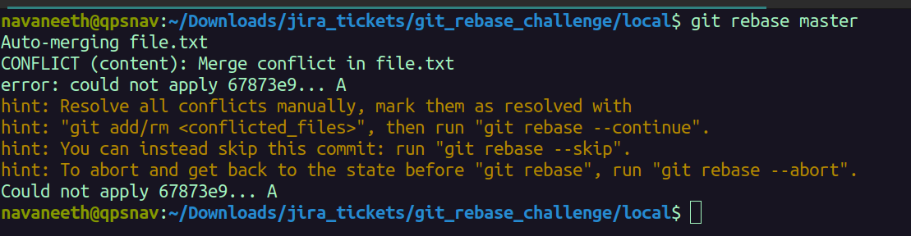
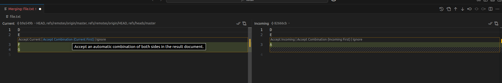
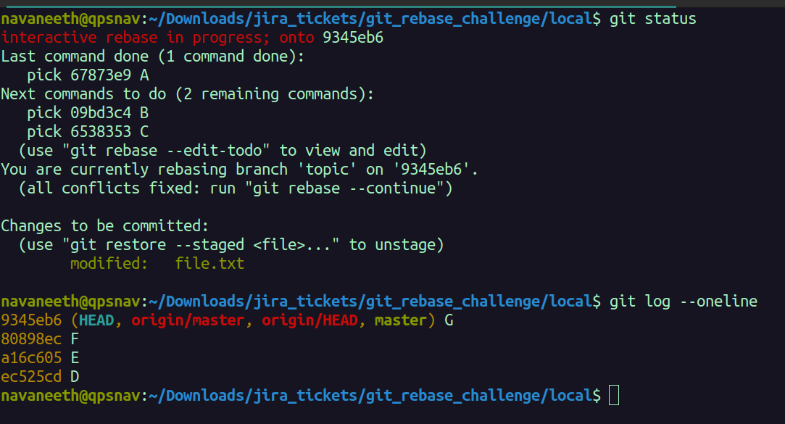
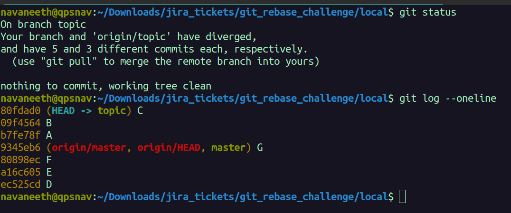
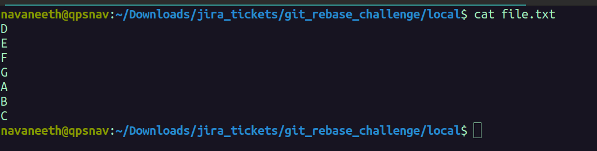
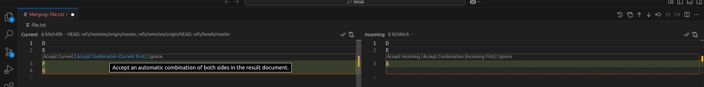
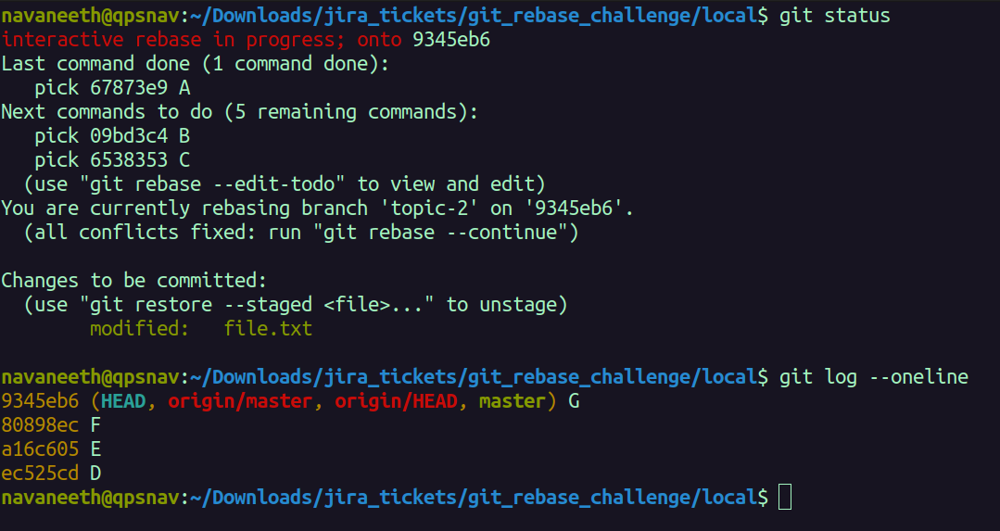
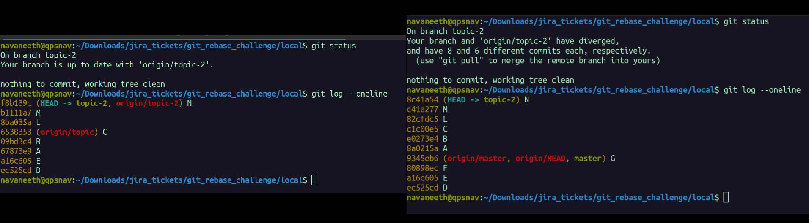
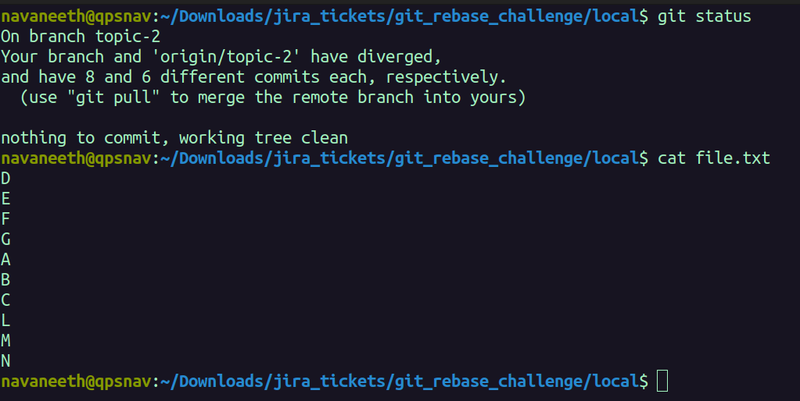

## Question
Given this scenario
```
				   L---M---N topic-2
				  /
		 A---B---C topic, origin/topic
        /
   D---E---F---G main
```
How do we get to the situation below?

```
							 L'---M'---N' topic-2, origin/topic-2
							/
				 A'---B'---C' topic, origin/topic
				/
   D---E---F---G main
```


## Rebasing `topic` onto `master`
```
cd local;
git checkout topic
git rebase master;
```
This will result in a merge-conflict because Git doesn't know which commit to apply first : `F` from `master`? or `A` from `topic`? 

</img>

We want to apply `F` from `master` first because we wish to order the commits as `D->E->F->G->A->B->C`. 
In this situation, I will use VSCode's GUI for resolving this merge-conflict.

</img>


The two panels on the left and right start out with the same sequence of commits `D->E->F` but, the panel on the left `Accept Combination (Current First)` shows the sequence of commits for `D->E->F->G` whereas the panel on the right `Accept Combination (Incoming First)` shows the sequence of commits `D->E->A`. We will choose `Accept Combination (Current First)` to apply the commits from `master` first. When we resolve this merge-conflict, our branch is in an intermediate state

</img>

Notice that the `HEAD` is at `G` (from `master`) because that was the last commit we applied when resolving the merge-conflict. We are yet to apply the subsequent commits `A`,`B`,`C` from `topic`. To apply those commits 
```
git rebase --continue;
```
This will open our default text editor for `git` (which happens to be `nano` in my case)
There's nothing to change in the commit message so I save the commit message as it is at which point we should get the confirmation message **"Successfully rebased and updated refs/heads/topic."**
Upon checking the status and logs of our branch `topic` we notice that our `local` branch has diverged from the `remote` branch and the sequence of commits is `D->E->F->G->A->B->C`

</img>

`git status` says **... have 5 and 3 different commits each, respectively**. That's because the original 3 commits of `topic` (`A`,`B`,`C`) have been replaced with new commits (`A'`,`B'`,`C'`) which have the same content as before but different commit-hash. ___At this point, I wish I had captured a screenshot of the commit-hash for the original sequenct of commits `D->E->A->B->C` to observe that rebasing indeed creates new commits___. 

And as for the contents of `file.txt`"

</img>

## Rebasing `topic-2` onto `master`
Now moving onto topic-2
```
git checkout topic-2;
git rebase master;
```
This will trigger a similar merge-conflict as before because `git` does not know which commit to apply first - `F` from `master` or `A` from `topic-2` (which was originally branched off from `topic`). As before, we want to apply the commits from `master` first because we wish to order the commits as `D->E->F->G->A->B->C->L->M->N`.

</img>

And as before, when we resolve this merge-conflict, our branch will be in an intermediate state with the `HEAD` stuck at `G` (from `master`) because that was the last commit we applied. We are yet to apply the remaining commits `A->B->C->L->M->N` from `topic2`

</img>

To apply the remaining commits from `topic` 
```
git rebase --continue;
```
And once again, this will open our default text-editor for `git` giving us the opportunity to save/edit the commit message. We do not wish to modify the commit message so we save it as it is at which point we are greeted with the message **Successfully rebased and updated refs/heads/topic-2.(())

Comparing the commit-hash of the before (left)and after(right) of the branch we can see that the commit-hashes for all the commits in `topic2` i.e `A`, `B`,`C`,`L`,`M`,`N` are different. 

</img>

And as for the final content of `file.txt`:

</img>
