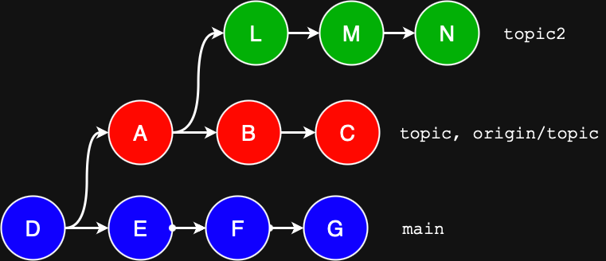
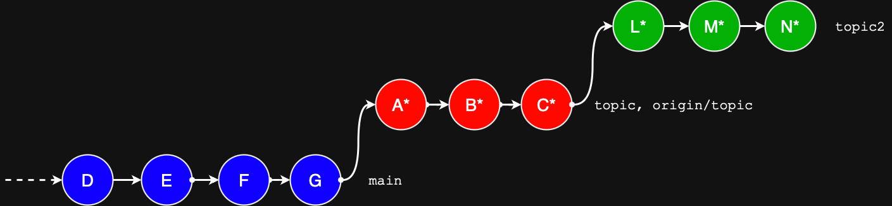

## Git Rebase Exercise

Give the scenario below:



How do we get to the situation below where both commits `F` and `G` 




### Challenge setup
- Create a folder and download `challenge.sh` to the folder. 
- On Windows use Git Bash to run the script, on Linux you can use your normal bash; you will need to cd to the folder you downloaded the script to, and then run it prefixed with a dot-slash:
    ```sh
    ./challenge.sh
    ```
- As mentioned, this first sets up a sub-folder called remote with the full commit history which serves as our "server." It then clones remote into the folder local which is your working directory. At any time if you mess up your repository you can reset it by deleting both folders and re-running the script.

### Expected Outcome

Below is the expected history in local, as shown with `git log --oneline` (obviously the hashes will be different):
```
$ git 1og --oneline
6ae423d (HEAD -> topic-2, origin/topic-2) N
e46ef0e M
1f20648 L
83561e8 (origin/topic, topic) C
457437c B
8296f73 A
4068cad (origin/main, origin/HEAD, main) G
5f0cbb7 F
5963ef6 E
26f6791 D
```

Additionally the contents of `file.txt` should have the following contents on each branch after the rebase

### Soution
[Solution](rebase-exercise-solution/Solution.MD)
